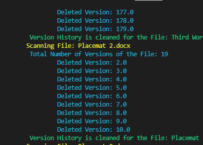
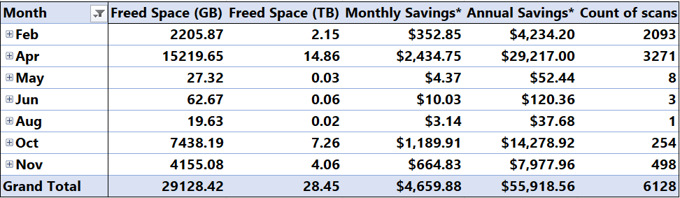

# sharepoint admin work
In my time as a SharePoint admin I got to work on quite a few interesting projects and it was in this work that I started to love writing PowerShell scripts to automate...well...anything!

## SharePoint storage cleanup
### Who:
My company who was looking at spending another ~!$10k for more SharePoint storage.
### What:
Freeing up storage space in our SharePoint tenant. 
### Why:
Saving money! Since we paid a flat fee for our storage at $0.16 (16 cents) per GB of cloud storage per month ($0.16/GB/MON) I had an easy way to calculate metric to measure the success of this project.
### File versioning: 
SharePoint's file versioning is great, but my company had left file versioning on and without limit for YEARS.   
### PowerShell solution:
[sharepoint-version-history-cleanup.ps1](https://github.com/iarichter/sharepoint-powershell/blob/main/sharepoint-version-history-cleanup.ps1)  
??? info "This script does quite a few things:"

    1. Start with a CSV file of all the sites you want to scan (I found it easier to track all the sites and results in excel, but no reason this too couldn't be   scripted out)
    2. Set the "versions to keep" variables:
        1. Default number (this will set the library limit as well)
        2. Archived versions to keep (see below for how 'archive' folders work)
        3. Versions to keep based on age of file:
            1. 5 years or older
            2. 2 years or older
            3. 1 year or older
    3. Looping through ALL the sites listed in the CSV file:
        1. Connect to the site with [PNP PowerShell](https://pnp.github.io/powershell/)
        2. Get all libraries (with some exclusions) and then loop through all of those:
            1. Set the library version limit (the Default number from above)
            2. Get ALL DOCUMENTS in that library and then loop through those:
                1. Set a variable for the number of versions each file has as well as the last modified date
                2. Process all the "versions to keep" logic applying the variables from above:
                    1. if the file path includes "archive"
                    2. elseif the file is older than 5 years
                    3. elseif the file is older than 2 years
                    4. elseif the file is oder than 1 year
                    5. else use the default number
                3. Check if the file has more versions than the "version to keep" variable selected with the logic and if TRUE:
                4. Loop through all versions of the file for the count of "current versions" minus "versions to keep":
                    1. 
    4. Final step is to export the logged results from all previous steps.

### Results:
The final version of this script took months to finalize, and a particularly gnarly eDiscovery hold issue prevented me from running this script on all sites for quite a while as well. However by December of that year I had the following results to brag about:
