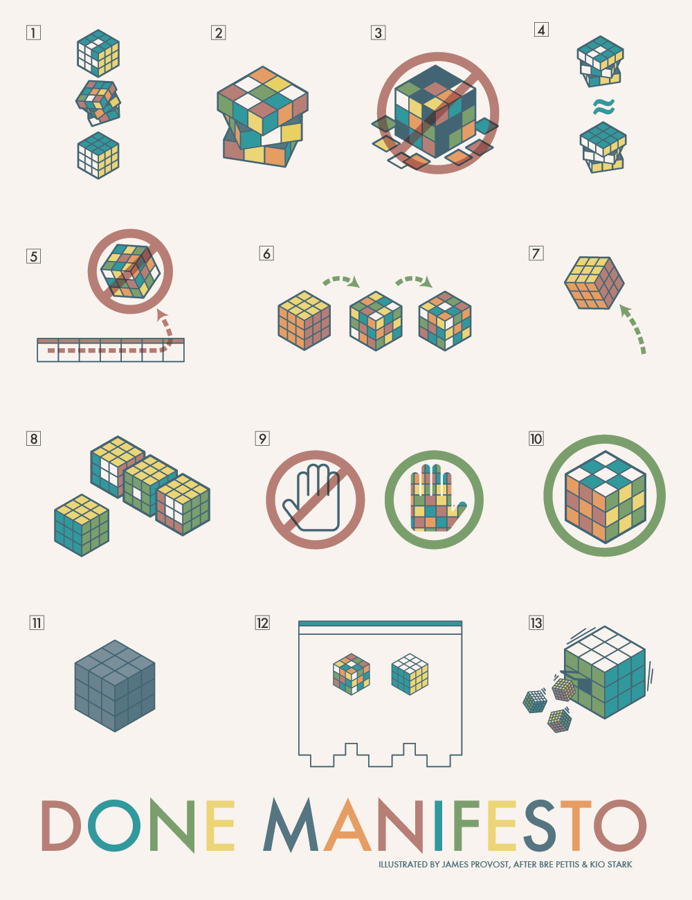

I love and loath this. Perhaps I'm afraid of what it implies.  
The primary caveat I have is that it assumes "done" as the goal/good and doesn't give much in ways of an argument *for* "done".  
Which is fine. There is enough here to enjoy and benefit from without having to answer: [What is the point of being done?]()

Specifically for creative activities, I consider this manifesto incredibly helpful:

## the manifesto
Credit to the authors: [Bre Pettis](https://www.brepettis.com/) & [Kio Stark](http://kiostark.com/)  

1. There are three states of being. Not knowing, action and completion.
1. Accept that everything is a draft. It helps to get it done.
1. There is no editing stage.
1. Pretending you know what you’re doing is almost the same as knowing what you are doing, so just accept that you know what you’re doing even if you don’t and do it.
1. Banish procrastination. If you wait more than a week to get an idea done, abandon it.
1. The point of being done is not to finish but to get other things done.
1. Once you’re done you can throw it away.
1. Laugh at perfection. It’s boring and keeps you from being done.
1. People without dirty hands are wrong. Doing something makes you right.
1. Failure counts as done. So do mistakes.
1. Destruction is a variant of done.
1. If you have an idea and publish it on the internet, that counts as a ghost of done.
1. Done is the engine of more.

## the visual
Credit to the artist: [James Provost](https://polysthetic.com/the-cult-of-done-manifesto/)
